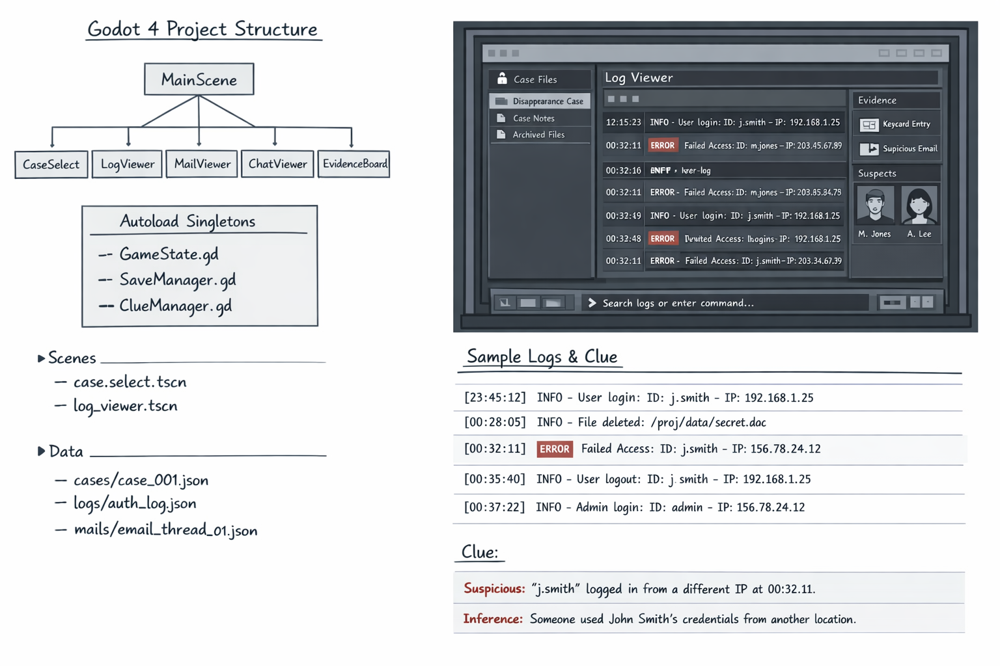

# LOG:404

로그를 읽고 사건을 푸는 싱글플레이 추리 게임 프로젝트입니다.  
현재 저장소는 **기획/설계 문서 체계화**와 **실행 계획 고정** 단계까지 완료된 상태입니다.



## 프로젝트 요약
- 장르: 싱글플레이 추리 퍼즐 / 로그 분석 / 디지털 포렌식 어드벤처
- 코어 판타지: 기술 문서를 읽고 실제 사건의 진실을 추론한다
- 대상 플랫폼: Windows + macOS (Steam)
- 목표 플레이타임: 1.5~3시간

## 저장소 구성
- `docs/`: 제품, 게임플레이, 퍼즐, UI/UX, 기술 스택, 데이터 구조, 플랫폼 노트
- `plan/`: 마스터 로드맵, MVP 실행, 수직 슬라이스, 리스크, 테스트, 출시 체크리스트
- `data/`: Python 프로토타입과 Godot 런타임이 함께 쓰는 canonical 콘텐츠 데이터
- `scenes/`, `scripts/`, `assets/`: Godot 4 런타임 프로젝트 골격
- `game/`, `web/`: Python CLI / 로컬 웹 프로토타입
- `docs/images/`: 초안 및 참고 이미지
- `review-notes/`: 일일 리뷰 체크리스트

## 먼저 읽을 문서
1. 제품 개요: [docs/01-product-overview.md](./docs/01-product-overview.md)
2. MVP 단일 기준: [docs/08-mvp-scope.md](./docs/08-mvp-scope.md)
3. 마스터 로드맵: [plan/00-master-roadmap.md](./plan/00-master-roadmap.md)
4. Steam/macOS 출시 체크리스트: [plan/06-steam-macos-release-checklist.md](./plan/06-steam-macos-release-checklist.md)
5. 구현 스택 결정: [docs/12-engine-stack-decision.md](./docs/12-engine-stack-decision.md)
6. Godot 런타임 아키텍처: [docs/13-godot-runtime-architecture.md](./docs/13-godot-runtime-architecture.md)

## 즉시 진행할 구현 단계
1. Godot 4 기본 프로젝트 및 씬 골격 구성
2. 로그 뷰어 + 검색/필터/북마크 흐름 구현
3. `CaseData`, `ClueData`, `ChapterGate` JSON 파이프라인 연동
4. 챕터 1 기준 15~20분 수직 슬라이스 구현 및 검증

## Godot 런타임 골격
저장소 루트에 `project.godot`가 포함되어 있으며, 실제 본게임 런타임은 **Godot 4 + GDScript**를 기준으로 구성합니다.

현재 포함된 골격:
- `project.godot`
- `scenes/`: 앱 루트, 메인 메뉴, 조사 워크스페이스, 증거 보드, 최종 보고
- `scripts/autoload`: 앱 상태, 콘텐츠 로더, 진행 서비스, 저장 서비스
- `scripts/domain`: 케이스/문서/단서/챕터 게이트/진행 상태 모델
- `scripts/ui`: 문서 리스트, 문서 뷰, 단서, 북마크, 보고서, 검색 바

실행:
1. Godot 4에서 이 저장소 루트를 엽니다.
2. `project.godot`를 프로젝트로 import 합니다.
3. 메인 씬은 `res://scenes/app_root.tscn` 입니다.

## CLI 프로토타입 실행
문서 기반 수직 슬라이스를 빠르게 검증할 수 있는 CLI 버전이 포함되어 있습니다.

```bash
python3 game/log404_cli.py
```

## GUI 프로토타입 실행
무의존성 로컬 웹 GUI 수직 슬라이스가 포함되어 있습니다.

```bash
python3 -m game.log404_gui --port 8000 --no-browser
```

그 다음 브라우저에서 `http://127.0.0.1:8000` 을 열면 됩니다.

GUI에서 가능한 것:
- 해금 문서 목록 열람 및 소스 타입 필터
- 문서 내용 확인, 북마크 토글, 검색 결과 이동
- 단서 확인 및 추론
- 저장 / 불러오기
- 최종 보고서 제출과 엔딩 확인

테스트 실행:

```bash
python3 -m unittest tests/test_game_engine.py
```
