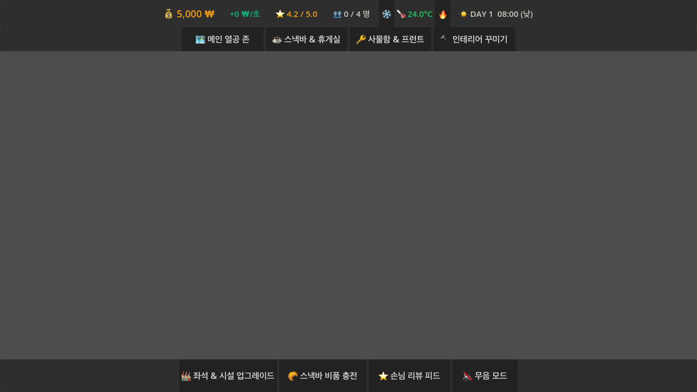
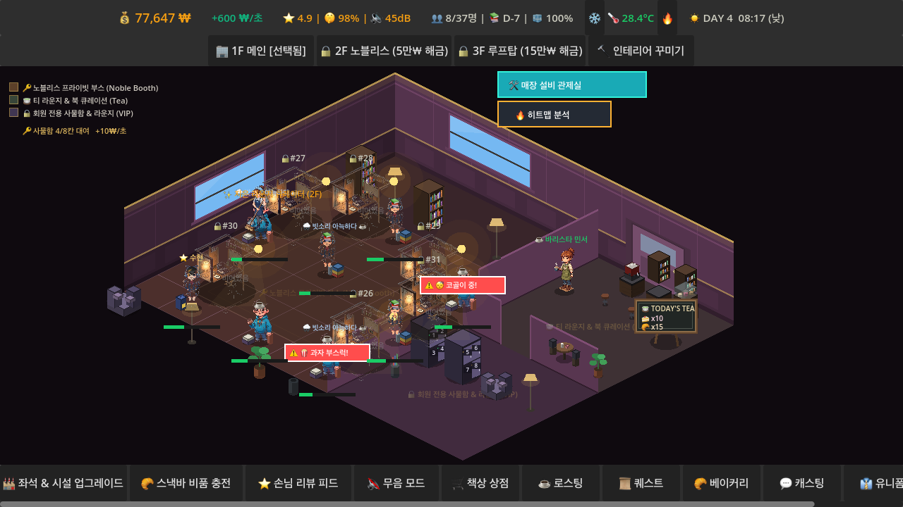
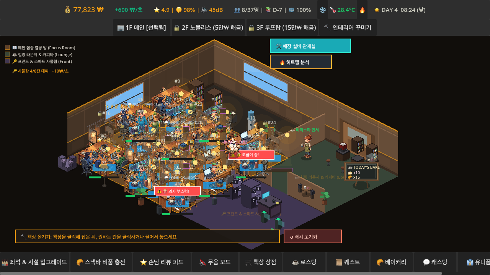

# ☕ 스터디 카페 타이쿤 (Study Cafe Tycoon) - game01

> **Godot 4 기반 2.5D 아소메트릭 방치형/경영 심뮬레이션 멀티플랫폼 타이쿤 게임**  
> 개발: Log404 Studio | 엔진: Godot Engine v4.6+ (GDScript)

---

## 📸 2.5D 비주얼 스크린샷 (Visual Showcase)

| 1층 메인 집중 열공 방 (Focus Room) | 2층 귀족 노블 부스 존 (Noble Booth) |
| :---: | :---: |
|  |  |

| 3층 루프탑 테라스 라운지 (Rooftop Terrace) | 2.5D 마그네틱 자석 그리드 배치 모드 |
| :---: | :---: |
|  |  |

---

## 📖 프로젝트 개요

**스터디 카페 타이쿤**은 수험생과 카공족을 유치하여 나만의 프리미엄 스터디 카페 콤플렉스를 경영하는 **2.5D 아기자기한 이소메트릭 힐링 경영 심뮬레이션**입니다.

---

## 🔥 핵심 시스템 & 주요 모듈

### 🏢 1. 다중 구역 통합 건축 구조 (Multi-Room Layout)
- **📖 메인 집중 열공 방 (Main Focus Study Room)**: 1인 독서실, 오픈 카페석, 요추지지 메쉬 의자, 방음 커튼, LED 조명 후광 연동
- **☕ 힐링 라운지 & 커피 바 (Lounge & Roasting Bar)**: 직영 로스팅 머신, 프리미엄 케이크 베이커리, 싱글 오리진 핸드드립 바
- **🔑 프런트 & 스마트 사물함 (Front & Locker Zone)**: 키오스크 입출입, 비밀번호 사물함, ANC 노이즈 캔슬링 헤드폰 대여 도크

### 🌧️ 2. 실시간 2.5D 날씨 & 조명 쉐이더 연출 (Atmospheric Weather & Circadian Lighting)
- **4종 날씨 사이클**: ☀️ 맑음, 🌧️ 빗소리 레이니 데이, ❄️ 눈 내리는 날, ☁️ 구름 많은 운치 있는 날
- **감성 말풍선 인터랙션**: 공부 중인 학생 머리 위에 `🌧️ 빗소리 아늑하다 ☕`, `❄️ 눈 오니 라떼 최고!` 등 감성 멘트 실시간 렌더링
- **매출 & 몰입 보너스**: 날씨별 음료 갈증도 및 학업 집중도 수치(+10% ~ +30%) 동적 가산

### 🧲 3. 인터랙티브 2.5D 책상 마그네틱 그리드 배치 (Magnetic Grid Placement)
- **자석 스냅 기술**: 책상 드래그 이동 시 2.5D 시안(Cyan) 타일 가이드라인 자동 활성화
- **정밀 스냅 & 회전**: 110px x 75px 그리드 단위 정밀 마그네틱 흡착 및 90도 회전 배치 지원

---

© 2026 **Log404 Studio**. All Rights Reserved.
